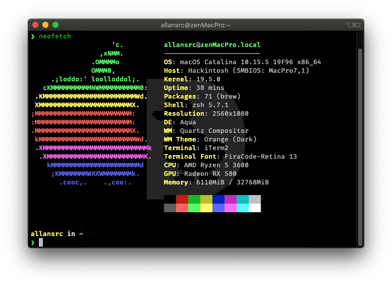
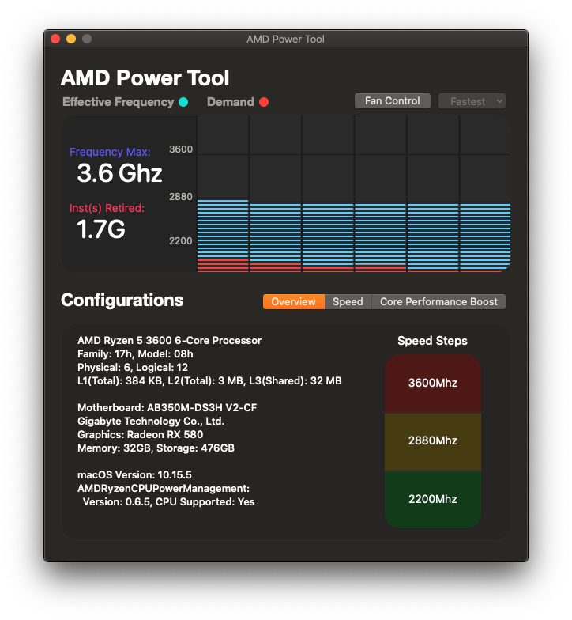

# AMD Ryzen 5 3600 - B350 - RX580 8GB OC

### >>> Disclamer

#

#### This branch is a build for OpenCore bootloader

#### You MUST NOT use the current SMBIOS, it MUST be generated for every macOS installation.

#

### >>> HARDWARE SETUP

###

| **Hardware**      | **Model**                        |
| ----------------- | -------------------------------- |
| CPU               | AMD Ryzen 5 3600 @ 3.6GHz        |
| Motherboard       | GA-AB350 DS3H V2                 |
| RAM               | 32GB (2 x 16GB) Maxsun @ 3000MHz |
| Audio Chipset     | ALC-887                          |
| GPU               | Asus AREZ RX 580 8g OC dual      |
| WiFi & Bluetooth  | WIP                              |
| OS Disk (NVMe)    | Samsung 960 Evo 250GB            |
| Data Disk (Sata3) | KingDian S370 512GB              |

###

**macOS version compatibility**: 11.0 | 10.15  
**OpenCore version bootloader**: 0.6.2

### what is not working:

1. 3.5mm Jack microphone (only USB/Bluetooth microphones)
2. OOB combojack

### WARNINGS:

** Adobe applications crash on AMD Hackintosh. But, You can fix it easily. Just google it about to get it working.
** Virtualization don't work property on "Ryzentoshes". In another hand, you can use VirtualBox or Parallels Desktop working as stable as possible.
So if you need **_Android Studio emulator_**, try using on these previous VM software (**Genymotion + vBox**), or Just giveUp.

## GUIDES

- [**AMD Installation Guides**](https://dortania.github.io/OpenCore-Install-Guide/installer-guide/)
- [**AMD setup config**](https://dortania.github.io/OpenCore-Install-Guide/AMD/zen.html)
- [**Post-install Guide**](https://dortania.github.io/OpenCore-Post-Install/)
- [**Common issues solving**](https://dortania.github.io/OpenCore-Post-Install/)

## HOW to USE THIS REPO

First things first. Get [**GenSMBIOS**](https://github.com/corpnewt/GenSMBIOS) to generate your SMBIOS IDs.

#### Do not use same ids in this repo!

You must run it and select **Generate SMBIOS** AS A **iMacPro1,1** or **MacPro7,1**. Then set ids generated in on your platform info.

**_p.s.:_** for iMacPro1,1, you need remove **_MacProMemoryNotificationDisabler.kext_** from kexts folder.

#### Do remove Memory fiel with its child dict if you dont use the same memories as me!

## Credits

- [[DSTs / kext path] OpenCore](https://olarila.com)
- [[Bootloader] OpenCore](https://github.com/acidanthera/OpenCorePkg)
- [[Resources] Picker GUI](https://github.com/acidanthera/OcBinaryData/tree/master/Resources)
- [[Patch] AMD_Vanilla](https://github.com/AMD-OSX/AMD_Vanilla)
